# ATOLL Architecture Diagrams

This document contains visual representations of the ATOLL system architecture, components, and workflows.

## Table of Contents
1. [System Architecture](#system-architecture)
2. [Hierarchical Agent Structure](#hierarchical-agent-structure)
3. [Deployment Server Architecture](#deployment-server-architecture)
4. [REST API Flow](#rest-api-flow)
5. [Agent Lifecycle](#agent-lifecycle)
6. [Remote Deployment Process](#remote-deployment-process)

---

## System Architecture

High-level overview of ATOLL components and their interactions:

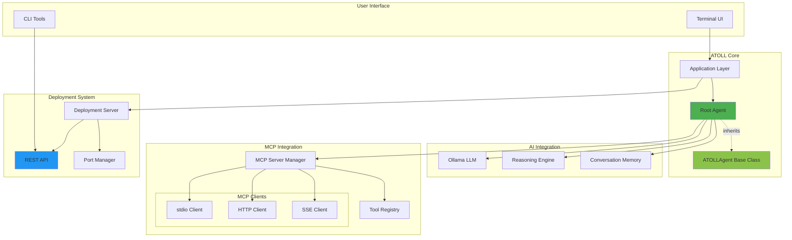

---

## Hierarchical Agent Structure

ATOLL v2.0's hierarchical agent system showing parent-child relationships:

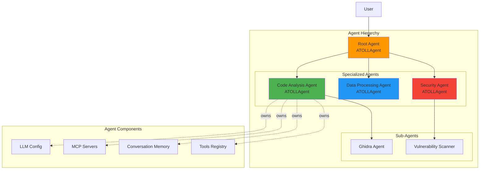

**Key Features:**
- Each agent inherits from `ATOLLAgent` base class
- Agents can have independent LLM configurations
- Agents maintain separate conversation memory
- Tools are scoped to agent context

---

## Deployment Server Architecture

Internal architecture of the deployment server:

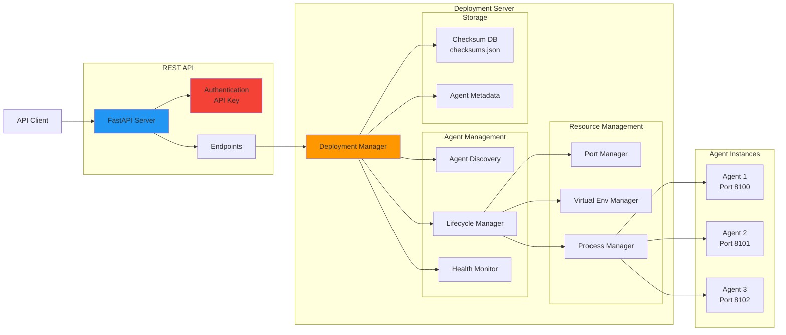

---

## REST API Flow

Request flow through the REST API with authentication:

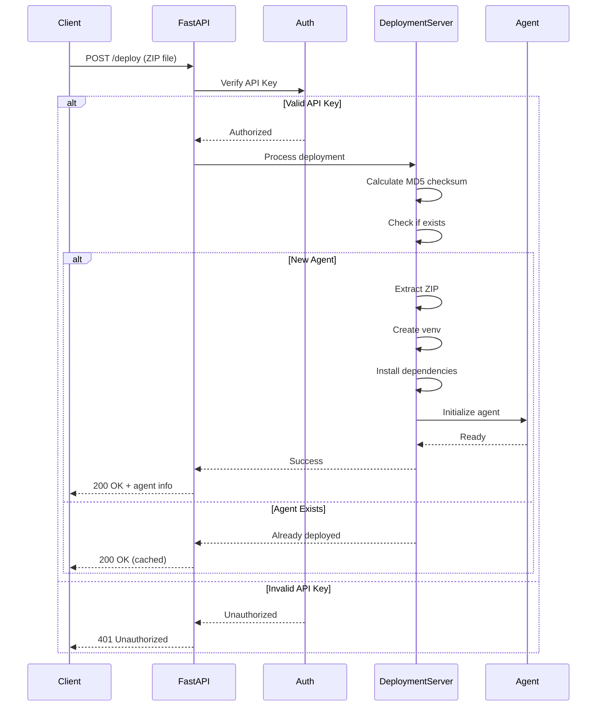

---

## Agent Lifecycle

State transitions and operations during agent lifecycle:

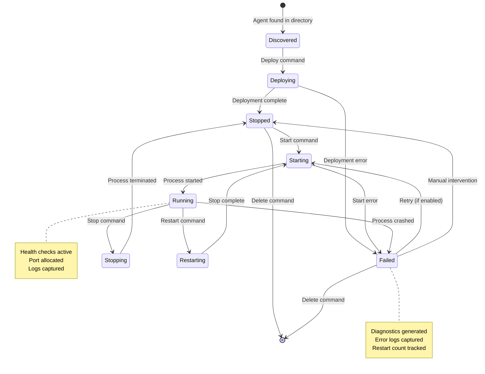

**State Descriptions:**

- **Discovered**: Agent configuration found, not yet deployed
- **Deploying**: Creating venv, installing dependencies
- **Stopped**: Agent deployed but not running
- **Starting**: Process being launched
- **Running**: Agent active and serving requests
- **Stopping**: Graceful shutdown in progress
- **Restarting**: Stop + Start sequence
- **Failed**: Error state with diagnostics available

---

## Remote Deployment Process

End-to-end flow for deploying an agent to a remote server:

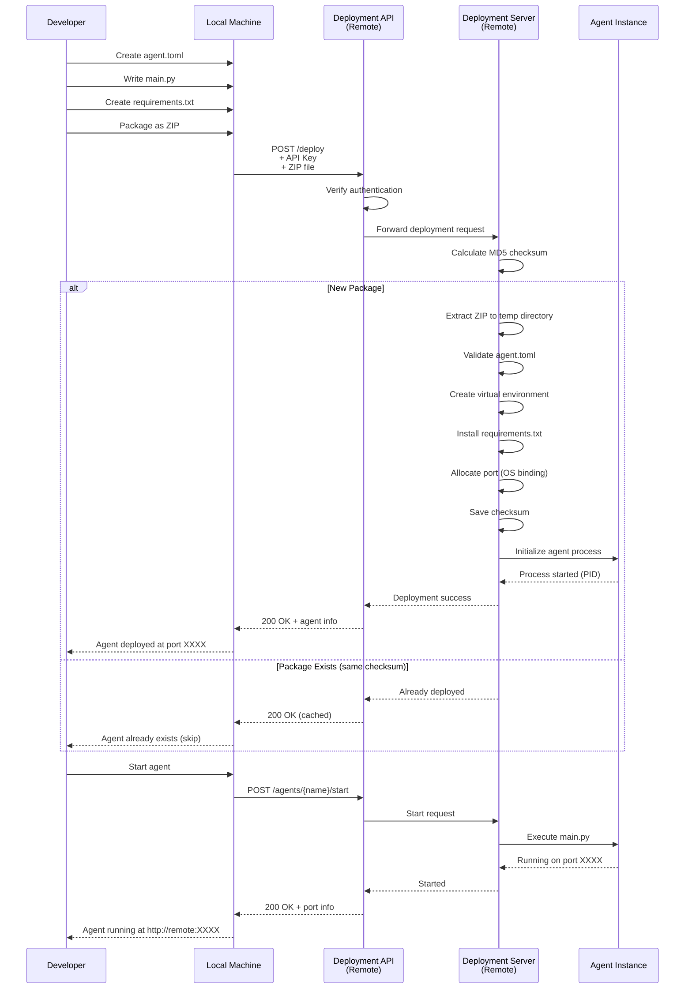

---

## Component Interaction Matrix

| Component | Interacts With | Purpose |
|-----------|----------------|---------|
| **Terminal UI** | Application Layer | User input/output |
| **Application** | Root Agent, Deployment Server | Orchestration |
| **Root Agent** | LLM, MCP Manager, Memory | User interaction |
| **MCP Manager** | MCP Clients, Tool Registry | Tool execution |
| **Deployment Server** | REST API, Port Manager, Agents | Agent lifecycle |
| **REST API** | Authentication, Deployment Server | Remote access |
| **Port Manager** | OS Sockets, Registry | Port allocation |
| **Agent Instance** | Virtual Env, Process Manager | Isolated execution |

---

## Data Flow Diagrams

### Tool Execution Flow

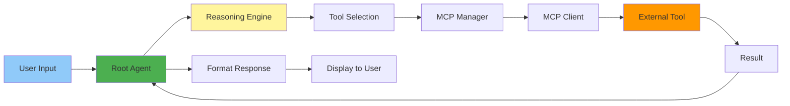

### Deployment Data Flow

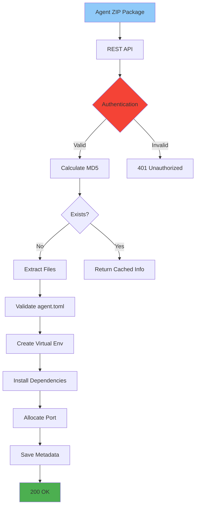

---

## Technology Stack

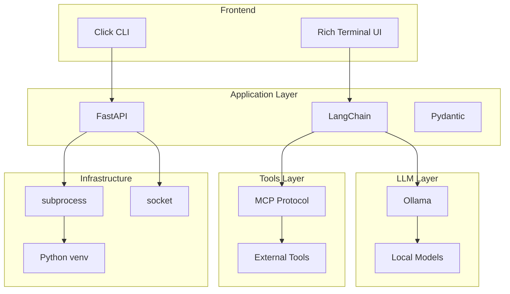

---

## Deployment Patterns

### Pattern 1: Local Development

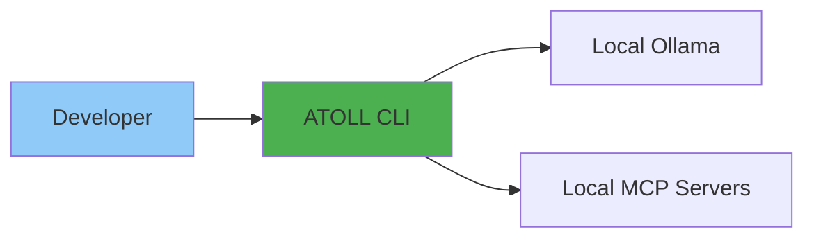

### Pattern 2: Remote Deployment

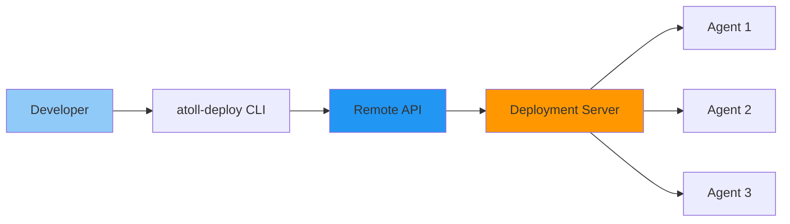

### Pattern 3: Multi-Server Setup

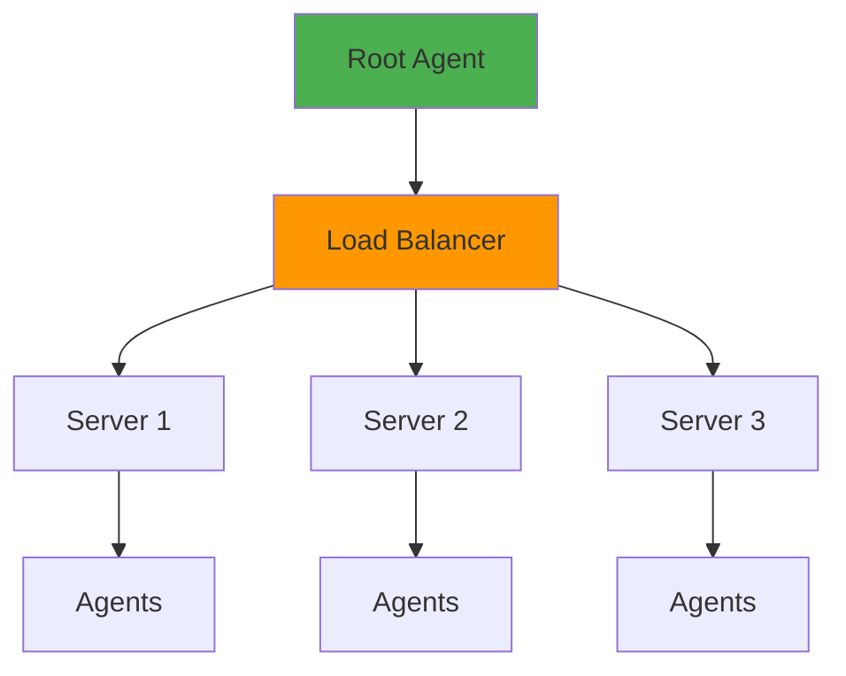

---

## Notes

- All diagrams are rendered using Mermaid syntax
- For interactive viewing, use a Mermaid-compatible viewer
- GitHub automatically renders these diagrams in Markdown
- VS Code supports Mermaid with appropriate extensions

---

**Tip:** To edit these diagrams, use the [Mermaid Live Editor](https://mermaid.live/) for instant preview.
