# ATOLL Architecture Diagrams

This document contains visual representations of ATOLL's architecture using Mermaid diagrams.

## Overall System Architecture


## Deployment Server Architecture


## Agent Deployment Flow


## MCP Tool Discovery and Execution


## Hierarchical Agent Pattern (Future v2.0)


## Port Allocation Strategy


## Authentication Flow


## CI/CD Pipeline

```mermaid
graph LR
    subgraph "Trigger"
        Push[Push to main/develop]
        PR[Pull Request]
        Tag[Version Tag v*.*.*]
    end
    
    subgraph "CI Jobs"
        Lint[Lint & Type Check<br/>ruff, mypy]
        Test[Test Matrix<br/>Ubuntu/Windows<br/>Python 3.9/3.11/3.12]
        Coverage[Coverage Check<br/>≥90% required]
    end
    
    subgraph "Build Jobs"
        BuildLinux[Build Package<br/>Ubuntu]
        BuildWin[Build Package<br/>Windows]
        Artifacts[Upload Artifacts]
    end
    
    subgraph "Release Jobs"
        GHRelease[Create GitHub Release]
        PyPI[Publish to PyPI]
    end
    
    Push --> Lint
    PR --> Lint
    Lint --> Test
    Test --> Coverage
    Coverage --> BuildLinux
    Coverage --> BuildWin
    BuildLinux --> Artifacts
    BuildWin --> Artifacts
    
    Tag --> GHRelease
    GHRelease --> PyPI
    
    style Lint fill:#e8f5e9
    style Test fill:#e3f2fd
    style Coverage fill:#ffebee
    style GHRelease fill:#f3e5f5
```



## Data Flow: Agent Lifecycle


## Configuration Management


---

## Diagram Rendering

These diagrams use [Mermaid](https://mermaid.js.org/) syntax and can be viewed:

1. **GitHub**: Renders automatically in markdown files
2. **VS Code**: Install "Markdown Preview Mermaid Support" extension
3. **Mermaid Live Editor**: https://mermaid.live/
4. **Command Line**: Use `mmdc` CLI tool

### Export as Images

```bash
# Install mermaid CLI
npm install -g @mermaid-js/mermaid-cli

# Export diagrams
mmdc -i docs/ARCHITECTURE_DIAGRAMS.md -o docs/architecture.png
```

---

**Last Updated:** January 2025  
**Version:** 2.0.0
